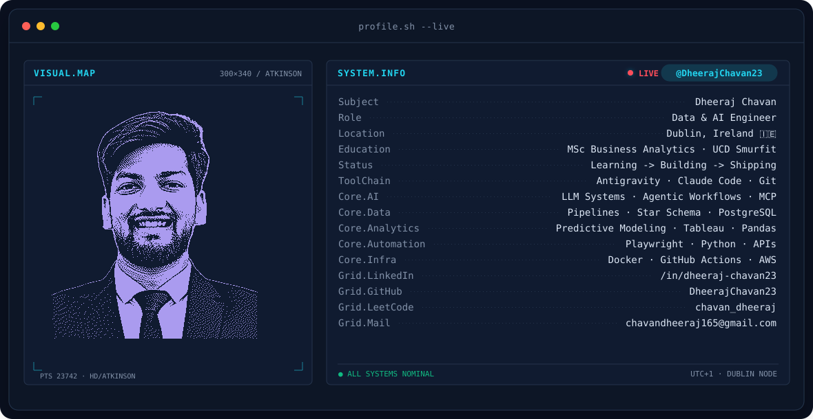
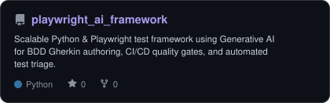
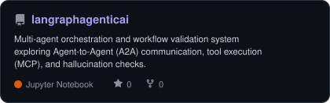
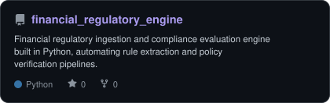
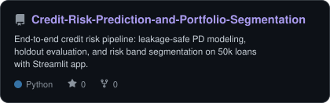
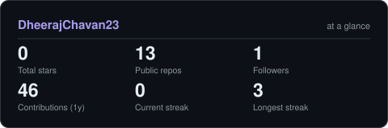

<!-- BANNER - terminal profile.sh --live (additive). Generated by scripts/banner/generate.py.
     Cache-bust with ?v=N after regenerating. -->
<picture>
  <source media="(prefers-color-scheme: dark)"  srcset="assets/banner-dark.v9.svg">
  <source media="(prefers-color-scheme: light)" srcset="assets/banner-light.v9.svg">
  
</picture>

 

<!-- NAME / TAGLINE - animated typing -->

 

<!-- SOCIALS & BADGES -->
&nbsp;&nbsp;
&nbsp;&nbsp;
&nbsp;&nbsp;

 

---

## This is me :)

Hi, I'm **Dheeraj**, **Data & AI Engineer** broadcasting from **Dublin, Ireland 🇮🇪**.

I work at the convergence of **Data Engineering**, **Artificial Intelligence**, **Quantitative Analytics**, and **Test Automation** — architecting reliable data backbones, multi-agent evaluation foundations, and production-grade automation systems.

- 🤖 **AI & Agentic Systems**: Building and evaluating agentic architectures executing via **Model Context Protocol (MCP)** and **Agent-to-Agent (A2A)** workflows, paired with **LLM-as-a-Judge**, golden benchmark datasets, and **Langfuse distributed tracing**.
- 📊 **Data & Predictive Analytics**: Designing end-to-end data pipelines, predictive models (probability of default, anomaly detection), and Tableau spatial decision-support systems.
- ⚙️ **Test Automation Engineering**: Engineering scalable automation frameworks in **Playwright (TypeScript / Python)** and **REST/GraphQL APIs**, driving shift-left quality gates that slash flaky test MTTR by 65%.
- 🗄️ **Data Architecture & SQL**: Modeling data warehouses with star schemas, optimizing ETL workflows, and conducting deep transactional verification across PostgreSQL and distributed stores.
- 🛠️ **Modern AI Toolchain**: Leveraging **Antigravity**, **Claude Code**, and **Git** to accelerate engineering velocity and ship robust systems.
- 🎓 **Academic Foundation**: Pursuing my MSc in Business Analytics at **UCD Michael Smurfit Graduate Business School**, Dublin.
- 💬 Talk to me about **Agentic AI, MCP, Data Engineering, and Playwright Automation**.

 

## my core stack

---

## signals 

<table>
<tr>
<td width="50%" align="center" valign="middle">

<!-- Core Competencies radar - edit assets/skills.json, the workflow redraws it -->
<picture>
  <source media="(prefers-color-scheme: dark)"  srcset="assets/radar-dark.svg">
  <source media="(prefers-color-scheme: light)" srcset="assets/radar-light.svg">
  
</picture>

</td>
<td width="50%" align="center" valign="middle">

<!-- Technical stack & tools radar - edit assets/langmix.json -->
<picture>
  <source media="(prefers-color-scheme: dark)"  srcset="assets/radar-langs-dark.svg">
  <source media="(prefers-color-scheme: light)" srcset="assets/radar-langs-light.svg">
  
</picture>

</td>
</tr>
</table>

---

## Featured Architecture & Systems

<!-- Cards generated by scripts/cards.py from assets/projects.json.
     Stars, forks and language are pulled live from the API on every run. -->
<table>
<tr>
<td width="50%">
  <a href="https://github.com/DheerajChavan23/playwright_ai_framework">
    <picture>
      <source media="(prefers-color-scheme: dark)"  srcset="assets/card-playwright_ai_framework-dark.svg">
      <source media="(prefers-color-scheme: light)" srcset="assets/card-playwright_ai_framework-light.svg">
      
    </picture>
  </a>
</td>
<td width="50%">
  <a href="https://github.com/DheerajChavan23/langraphagenticai">
    <picture>
      <source media="(prefers-color-scheme: dark)"  srcset="assets/card-langraphagenticai-dark.svg">
      <source media="(prefers-color-scheme: light)" srcset="assets/card-langraphagenticai-light.svg">
      
    </picture>
  </a>
</td>
</tr>
<tr>
<td width="50%">
  <a href="https://github.com/DheerajChavan23/financial_regulatory_engine">
    <picture>
      <source media="(prefers-color-scheme: dark)"  srcset="assets/card-financial_regulatory_engine-dark.svg">
      <source media="(prefers-color-scheme: light)" srcset="assets/card-financial_regulatory_engine-light.svg">
      
    </picture>
  </a>
</td>
<td width="50%">
  <a href="https://github.com/DheerajChavan23/Credit-Risk-Prediction-and-Portfolio-Segmentation">
    <picture>
      <source media="(prefers-color-scheme: dark)"  srcset="assets/card-Credit-Risk-Prediction-and-Portfolio-Segmentation-dark.svg">
      <source media="(prefers-color-scheme: light)" srcset="assets/card-Credit-Risk-Prediction-and-Portfolio-Segmentation-light.svg">
      
    </picture>
  </a>
</td>
</tr>
</table>

| Project | Focus & Core Stack |
|---|---|
| **[playwright_ai_framework](https://github.com/DheerajChavan23/playwright_ai_framework)** | `Python` `Playwright` `GenAI BDD` `Quality Gates` |
| **[langraphagenticai](https://github.com/DheerajChavan23/langraphagenticai)** | `LangGraph` `Multi-Agent` `MCP Validation` `A2A` |
| **[financial_regulatory_engine](https://github.com/DheerajChavan23/financial_regulatory_engine)** | `Python` `Regulatory Ingestion` `Compliance Rules` |
| **[Credit-Risk-Prediction](https://github.com/DheerajChavan23/Credit-Risk-Prediction-and-Portfolio-Segmentation)** | `Python` `Risk Modeling` `PD Evaluation` `Streamlit` |

---

## Numbers matter? ohhh yes. 

<!-- Generated by scripts/cards.py into this repo. Deliberately NOT
     github-readme-stats / streak-stats: these are native SVGs queried directly from
     GitHub APIs with zero external service downtime. -->
<picture>
  <source media="(prefers-color-scheme: dark)"  srcset="assets/card-stats-dark.svg">
  <source media="(prefers-color-scheme: light)" srcset="assets/card-stats-light.svg">
  
</picture>

 

---

` Learning -> Building -> Shipping · Dheeraj Chavan `

